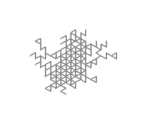

# L-System implementation

This repo contains a simple implementation in Rust of [L-System](https://en.m.wikipedia.org/wiki/L-system) to generate images.

Example of rendering for the L-System 

```json
{
    "start":"F+G",
    "rules":{
        "F":"F+FG-[G+F-F]",
        "G":"F-F+[FF-G-G]"
    },
    "angle":120,
    "iter":3
}
```



## Usage

```
cargo run -- [-f filepath] [-o file]
```

The rendering part can be a little long if you want a high number of iteration. You can use the --release flag if you want to speed up the rendering:

```
cargo run --release -- [-f filepath] [-o file]
```

You have sample file in the `sample` folder.

By default, the rendered image will be in the `render` folder, you can customize the output file with the `-o` parameter.

If you didn't put an input file, a random LSystem will be generated. If the image is too wide (can cause allocation error), we remove one iteration from the system and try again.